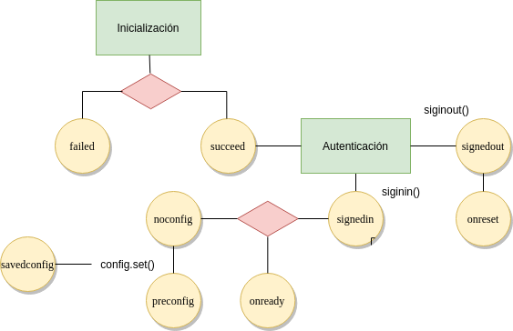

# Braulio (core)

**Braulio** es una aplicación web bastante modesta que facilita la gestión de
[cuentas G-Suite](https://gsuite.google.es/) y, en particular:

* Las tareas de alta y baja de alumnos y profesores.
* La gestión de grupos necesarios:

   - Departamentos.
   - Tutores.
   - Grupos de alumnos.
   - Equipos educativos.

Por supuesto, esta gestión puede hacerse manualmente a través de la [interfaz
oficial](https://admin.google.com:), pero **Braulio** está diseñada para hacer
éstas específicamente, así que automatiza o semiautomatiza muchas de ellas y
ahorra tiempo y esfuerzo.

El repositorio no contiene implementación de interfaz web alguna, sólo contiene
el código Javascript que conecta con las [APIs de
Google](https://developers.google.com/apis-explorer). Para ella, consulte
[braulio-app](https://github.com/sio2sio2/braulio-app).

## Preparación del dominio

Para poder utilizar la aplicación es preciso:

* En [admin.google.com>Seguridad>Permisos de la API>Control de acceso de
  aplicaciones](https://admin.google.com/ac/owl/list?tab=services&hl=es)
  eliminar las restricciones a "Administrador de G-Suite".

* En la [consola de desarrollador](https://console.developers.google.com):

  + Crear un nuevo proyecto.

  + En la pantalla de consentimiento, hacer que el proyecto sea de tipo interno
    y darle un nombre.

  + Crear credenciales:

    1. Un identificador de cliente para una aplicación web (que será el
       ``clientId`` en nuestra aplicación).
    1. Una clave de API (que será la ``apiKey`` en nuestra aplicación).

  + Habilitar las APIs:

    1. [Admin SDK](https://developers.google.com/admin-sdk/directory), que
       permite manipular las cuentas de G-Suite.
    1. [Groups Settings API](https://developers.google.com/admin-sdk/groups-settings/get_started),
       que permite definir cuál es el acceso a las cuentas de grupo. Por ejemplo,
       si es posible que una cuenta externa, escriba a un grupo de G-Suite.
    1. [Drive API](https://developers.google.com/drive/api/v3/reference), que
       permite leer y escribir en el *Drive* del usuario. En este proyecto, es
       necesario para poder guardar la configuración de la aplicación.
    1. [Gmail API](https://developers.google.com/gmail/api), que permite el envío
       de mensajes.

## Organización del dominio

Las cuentas del instituto se organizarán del siguiente modo:

1. Tres unidades organizativas:

   * **Profesores**, para profesores.
   * **Alumnos**. para alumnos.
   * **Otros**, para cuentas que no sean de profesores ni de alumnos (p.e. una
     cuenta para la biblioteca del centro).

1. Dos grandes grupos relacionados con estas unidades organizativas:

   * **claustro**, que incluirá todos los grupos que representan
     departamentos didácticos o de formación profesional (lo que indirectamente
     supondrá que contenga a todos los profesores).
   * **alumnos**, que incluirá todos los grupos de alumnos (lo que
     indirectamente supondrá que contenga a todos los alumnos).

1. Grupos que contienen usuarios:

   * Un grupo por cada **departamento didáctico**, cada uno de los cuales
     contendrá a los profesores de tal departamento.
   * Un grupo por cada **conjunto de tutores** que se estime oportuno. La
     interfaz dejará libertad para crear estos grupos y marcar a los profesores
     que formen parte e ellos. Existirá, además, un grupo **tutores** que
     contenga todo estos grupos.
   * Un grupo por cada **grupo de alumnos**, cada uno de los cuales contendrá a
     los alumnos de tal grupo.
   * Un grupo por cada **equipo educativo**, cada uno de los cuales contendrá a
     los profesores que imparten clase en el grupo de alumnos correspondiente.

1. Cuentas de usuario:

   * Una para cada **profesor**, cada una de las cuales deberá estar en un
     departamento.
   * Una para cada **alumno**, cada una de las cuales deberá estar en un grupo
     de alumnos.
   * **Otras cuentas** que servirán para cualquier propósito:

     + Servicios del instituto (*Biblioteca*, *Secretaría*).
     + Cargos (en caso de que se prefiera una cuenta nueva a crearle un alias
       al que desempeña el cargo).

---
**Nota**

Sería conveniente también formar grupos de alumnos para cada asignatura, porque
permitiría formar los grupos de
[Classroom](https://edu.google.com/products/classroom), pero
eso exige disponer de un método sencillo para obtener esos datos de Séneca y no
existe. Es probable que los institutos antes de volcar los datos en Séneca,
creen los grupos con alguna otra herramienta (p.e. hojas de cálculo) que permita
una exportación más sencilla; pero al ser métodos semimanuales y no estar
normalizados, no hay forma de crear una herramienta universal de importación.

---

## Uso

El código depende de
[gapi-client](https://github.com/google/google-api-javascript-client), el cual
debe cargarse siempre a través de una etiqueta ``script``, se use cualquiera de
los dos métodos que se enuncian a continuación.

### Directamente en el navegador

Descargue el código ``dist/braulio-core.js`` y al final de su página HTML
coloque los elementos ``script``:

~~~html

   
   
</html>

~~~

En su código *Javascript* podrá utilizar el cliente *Braulio* a través de la
función ``Braulio``:

~~~javascript

window.onload = function(e) {
   const cliente = Braulio("config.json", {
      clientId: "###---CLIENT ID---###",
      apiKey: "###---API KEY---###",
      hosted_domain: "iesmiinstituto.com"
   });
   // etc...
}

~~~

### Desarrollando con NodeJS

Instale la librería en su directorio de desarrollo:

~~~console

$ npm install git+https://github.com/sio2sio2/graulio-core.git

~~~

En el código *Javascript* que está escribiendo, importe la función:

~~~javascript

import Braulio from "braulio-core";

const cliente = Braulio("config.json", {
         clientId: "###---CLIENT ID---###",
         apiKey: "###---API KEY---###",
         hosted_domain: "iesmiinstituto.com"
      });

~~~

Recuerde que en el código HTML deberá incluir la carga de ``gapi``:

~~~html

   
</html>

~~~

## Inicialización (guía rápida)

~~~javascript 

window.onload = function(e) {
   // Elemento sobre el que pinchamos para
   // autenticarnos o salirnos de la aplicación.
   const ingresar = document.getElementById("ingresar");

   // Creamos nuestro resolutivo mayordomo
   const mayordomo = Braulio("config.json", {
            clientId: "###---CLIENT ID---###",
            apiKey: "###---API KEY---###",
            hosted_domain: "iesmiinstituto.com"
         });

   // Al cargarse convenientemente el autenticador de Google,
   // dotamos de funcionalidad al botón.
   mayordomo.on("succeed", function(e) {
      ingresar.addEventListener("click", e => {
         if(e.target.textContent === "Entrar") mayordomo.signin();
         else mayordomo.signout();

      });
   }):

   // Pero si no se carga bien no hay nada que hacer.
   mayordomo.on("failed", function(e) {
      ingresar.addEventListener("click", funcion(e) {
         alert("IMPOSIBLE CARGAR EL MÓDULO DE AUTENTICACIÓN")
      });
   });

   // Nos hemos autenticado con éxito,
   // pero aún puede no estar disponible la configuración.
   mayordomo.on("signedin", function(e) {
      ingresar.textContent = "Salir";

      // Podríamos habilitar elementos de la interfaz que no
      // requirieran la información contenida en el fichero de configuración
   });

   // Se ha cargado ya la configuración
   mayordomo.on("onready", functioN(e) {
      // Cuando e.action es "get" llegamos al evento habiendo
      // cargado normalmente la configuración existente.
      if(e.action === "get") console.log("Configuración cargada");
      else console.log("Configuración generada y cargada");

      // Habilitamos la interfaz, pòrque ya está todo
      // preparado para poder gestionar G-Suite.
   }):

   // Si al autenticarnos nos encontramos con que
   // no hay configuración previa (p.e. la primera
   // ver que ejecutamos la aplicación). Antes de generar
   // una inicial se lanza este evento.
   mayordomo.on("noconfig", function(e) {
      console.log("No hay configuración");

      // Quizás queramos hacer algo, aunque no es obligatorio.
   });

   // Ya generada una configuración inicial, se lanza este evento.
   mayordomo.on("preconfig", function(e) {
      console.log(this.config.content);  // Aquí está la configuración inicial

      // Es probable que queramos modificar la configuración
      // añadiendo departamentos, etc. de forma interactiva.
      // ...

      // Una vez modificada la configuración, la aplicación estará lista.
      this.fire("onready", {action: "set"});
   });

   // Nos hemos autenticado con éxito,
   // pero aún puede no estar disponible la configuración.
   mayordomo.on("signedout", function(e) {
      ingresar.textContent = "Entrar";

      // Deshabilitamos los elementos de la interfaz
      // que nos permiten gestionar G-Suite
   });

   mayordomo.init();
}

~~~

Échele un ojo al [ejemplo de
uso](https://github.com/sio2sio2/braulio-core/tree/master/examples).

## API

### Braulio

#### Inicialización

La inicialización podemos dividirla en tres tareas:

- La creación del objeto mediante la función ``Braulio``.

  ~~~javascript

      const mayordomo = Braulio("config.json", {
               clientId: "###---CLIENT ID---###",
               apiKey: "###---API KEY---###",
               hosted_domain: "iesmiinstituto.com"
            });

  ~~~

  El primer parámetro define el nombre que se usará para el fichero de
  configuración almacenado en el Drive del usuario que se autentica. El
  segundo argumento define los parámetros usandos en el proceso de
  autentición con Google.

- La definición de las tareas relacionadas con la autenticación.

  La función anterior no crea más que el *mayordomo*, porque antes de hacer algo
  es necesario prescribir qué debe hacerse ante una autenticación, un error en
  la carga de la autenticación, etc. Para ello es necesario asignar acciones
  a los distintos eventos:

  

  | Evento         | Se dispara cuando....                  |
  | -------------- | -------------------------------------- |
  | ``succeed``    | se inicializó con éxito.               |
  | ``failed``     | error en la inicialización.            |
  | ``signedin``   | se produjo la autenticación.           |
  | ``noconfig``   | no hay configuración previa.           |
  | ``preconfig``  | se acaba de generar una conf. inicial. |
  |``configerror`` | no se completa correctamente la conf.  |
  | ``onready``    | estamos listos para empezar,           |

  Existen, además, otros eventos no relacionados con la inicialización:

  | Evento          | Se dispara cuando....                  |
  | --------------- | -------------------------------------- |
  | ``signedout``   | se ha completado desautenticación.     |
  | ``savedconfig`` | se ha guardado la configuración,       |
  | ``onreset``     | nos desvinculamos de la configuración. |

  

- La inicialización propiamente dicha a través del método ``.init()``:

  ~~~javascript

     mayordomo.init();

  ~~~

  Esto arrancará el proceso de inicialización y, dependiendo del caso, irá
  desencadenando los eventos correspondientes (razón por la cual debía
  estar definido qué hacerse antes de utilizar el método).

#### Autenticación

La autenticación tiene asociados dos métodos:

| Método        | Descripción                          |
| ------------- | ------------------------------------ |
| ``signin()``  | Arranca el proceso de autenticación. |
| ``signout()`` | Desconecta la aplicación,            |

Por ello, en el ejemplo de código propuesto en la guía rápida, asociamos estos
dos métodos al botón que designamos para entrar y salir de la aplicación:

~~~javascript

ingresar.addEventListener("click", e => {
   if(e.target.textContent === "Entrar") mayordomo.signin();
   else mayordomo.signout();
});

~~~

---
**Nota**

No obstante, si el usuario ya se encontraba autenticado (p.e. porque se había
consultado previamente el correo de *Gmail*), esta autenticación será automática
y no requerirá explícitmanete ejecutar el método.

---

Para cuando se completa el ingreso o la salida, hay dos eventos:

| Evento        | Se desencadena cuando...              |
| ------------- | ------------------------------------- |
| ``signedin``  | ... el usuario abre una sesión.       |
| ``signedout`` | ... el usuario sale de la sesión.     |

Es importante significar que completar con éxito la autenticación, no significa
que estemos en disposición de gestionar G-Suite, ya que la aplicación necesita
también leer el fichero de configuración. Esta es un acción que sólo puede
realizarse tras la autenticación, por lo que al desencadenarse el evento
**onready**, podemos estar seguros de que la aplicación ya está lista para que
el usuario interactúe plenamente con ella.

#### Eventos

Ya se han enumerado [todos los eventos reconocibles](#eventos) y cuándo se
disparan. Es, sin embargo, pertinente profundizar en ellos.

Hay varios métodos relacionados con la manipulación de eventos:

| Evento                 | Descripción                                              |
| ---------------------  | -------------------------------------------------------- |
| ``on(nombre, func)``   | Registra la función en el evento *nombre*.               | 
| ``once(nombre, func)`` | Registra la función para ejecutarse una sola vez.        |
| ``off(nombre, func)``  | Cancela el registro de la función del evento *nombre*.   |
| ``off(nombre)``        | Cancela todas las acciones asociadas al evento *nombre*. |
| ``fire(nombre, obj)``  | Dispara las funciones del evento *nombre*.               |

Un ejemplo de uso, lo tenemos recogido en el [código inicial](#ejemplo):

~~~javascript

   // Se ha cargado ya la configuración
   mayordomo.on("onready", functioN(e) {
      if(e.action === "set") console.log("Configuración generada y cargada");
      else console.log("Configuración cargada");
   }):

~~~

Para todos los tipos de eventos el objeto ``e`` disponible en las funciones disparadas incluye:

| Atributo    | Descripción                                              |
| ----------- | -------------------------------------------------------- |
| ``type``    | Tipo de evento disparado (*signedin*, *failed*, etc).    |
| ``target``  | El propio objeto mayordomo.                              |

En algunos tipos, puede presentar algún atributo más. El evento *onready* añade:

| Atributo    | Descripción                                                                  |
| ----------- | ---------------------------------------------------------------------------- |
| ``action``  | Con valor *get* indica que se desencadena al leer la configuración guardada. |

En el caso de ``.fire()``, si se le proporciona como argumento un objeto
adicional, los atributos de éste se añaden a los del objeto evento disponible
en las funciones disparadas:

~~~javascript

   mayordomo,fire("onready", {action: "set"});

~~~

### Configuración

La aplicación necesita almacenar información adicional referente a:

- el grupo que representará al claustro y contendrá todos los departamentos
  didácticos.
- el grupo que representará a los alumnos y contendrá todos los grupos de
  clase.
- el grupo que incluya a todos los tutores.
- los puestos adcritos a los distintos departamentos didácticos.
  Por ejemplo, es necesario conocer que el profesor con puesto
  *10590006* pertenece al departamento de Matemáticas.

Para ello usa un fichero en formato JSON que se almacena en el directorio para
datos de aplicaciones del [Drive](https://drive.google.com) del usuario
administrador y que tiene esta estructura:

~~~json

{
   "contenedores": {
      "claustro": { "id": "### identificador del grupo ###" },
      "alumnos": {"id": "### identificador del grupo ###" },
      "tutores": {"id": "### identificador del grupo ###" },
   },
   "ou": {
      "claustro": { "orgUnitId": "### identificador de la ou ###" },
      "alumnos": { "orgUnitId": "### identificador de la ou ###" },
      "misc": { "orgUnitId": "### identificador de la ou ###" }
   },
   "departamentos": [
      { 
         "id": "### Identificador del grupo de Filosofía ###",
         "puestos": [ "/[0-1][0-9]590001/" ]
      },
      {
         "id": "### Identificador del grupo de Lenguas Clásicas ###",
         "puestos": [ "00590002" , "00590003" ]
      }
   ]
}

~~~

El fichero almacena identificadores para evitar que una manipulación manual de
alguno de los nombres de grupo inutilice la aplicación. Al completarse con
éxito la autenticación, se intenta cargar el fichero de configuración:

- Si lo encuentra, hará consultas para obtener los nombres, direcciones y
  descripciones, de los grupos y la ruta de las unidades organizativas a partir
  de los identificadores almacenados. Una vez completada esta tarea se
  disparará el evento *onready*.
- Si no lo encuentra, disparará el evento *noconfig*, generará un fichero
  de configuración predeterminado y disparará el evento *preconfig*, útil por
  si se quiere habilitar que el usaurio pueda modificar ese fichero predefinido.

  ~~~javascript

  mayordomo.on("noconfig", function(e) {
      // Aquí podemos incluir algún aviso de que no hay configuració inicial
  });

  mayordomo.on("preconfig", function(e) {
      // En este punto ya se ha generado el fichero predefinido y podemos
      // habilitar algún mecanismo para que el usuario lo altere.
      // Después de los cambios, lo lógico es que nosotros mismo forcemos
      // el evento "onready":

      this.fire("onready", {action: "set"});
  });

   meyordomo.on("onready", function(e) {
      if(e.action === "get") console.log("Configuración cargada");
      else console.log("Configuración generada correctamente");

      // Ahora podemos habilitar por completo la interfaz.
   });

  ~~~

Por otra parte, el mayordomo dispone del atributo ``config`` que es un objeto
con algunos atributos y métodos útiles:

| Atributos                      | Descripción                                 |
| ------------------------------ | --------------------------------------------|
| ``config.content``             | Objeto con la configuración.                |
| ``config.id``                  | Identificador del fichero de configuración. |
| ``config.status``              | Devuelve el estadoo: *PRECONFIG*, *READY*   |
| ``config.set(content, merge)`` | Guarda la nueva configuración.              |
| ``config.remove()``            | Elimina la configuración.                   |

Es importante tener presente tres cosas:

1. El objeto que debe pasarse a ``config.set()`` se usará sin modificaciones
   para dar valor a ``config.content`` y, convenientemente depurado, para
   guardarse en el *Drive*.  La depuración consistirá en eliminar nombres y
   descripciones y dejar sólo los identificadores. El argumento ``merge`` a
   verdadero hace que el contenido suministrado no sustitutya al actual, sino
   que se añada a éste.

1. ``config.remove()`` elimina exclusivamente el fichero de configuración, pero
   no los grupos o las unidades organizativas declaradas en tal fichero. Si se
   desea eliminar esa estructura habrá de llevarlo acabo de forma independiente.

1. Una configuración completa tendrá estado *READY*; mientras que una
   configuración que se está áun generando tendrá estado *PRECONFIG*.

### API de manipulación de G-Suite
